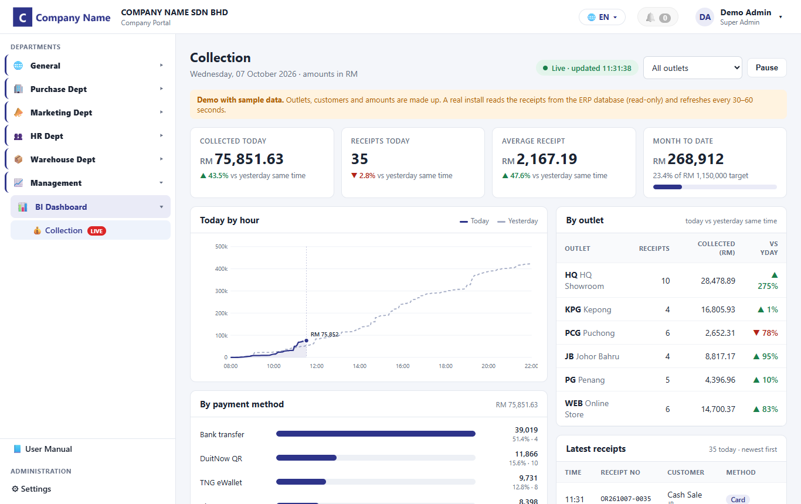
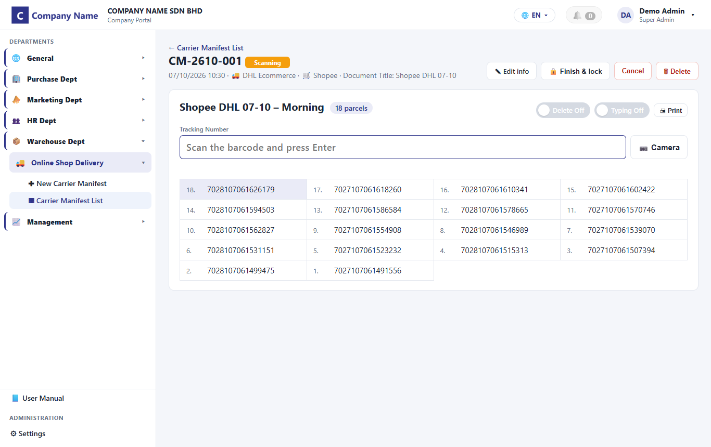
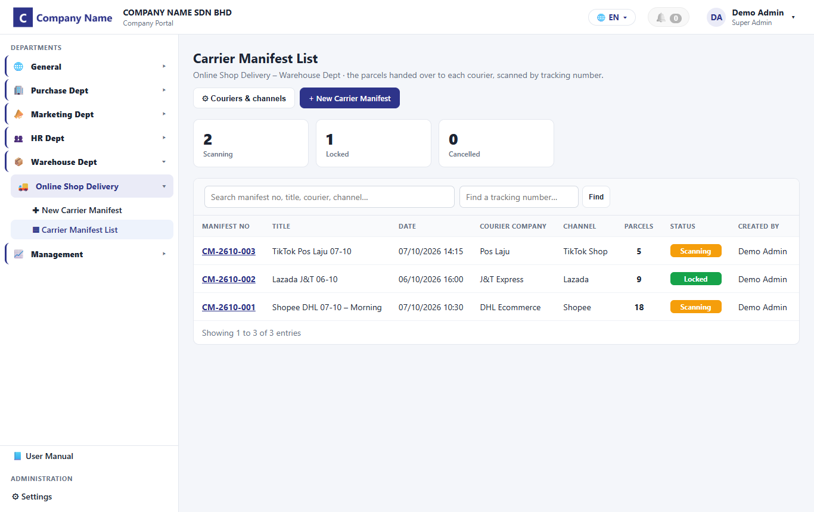
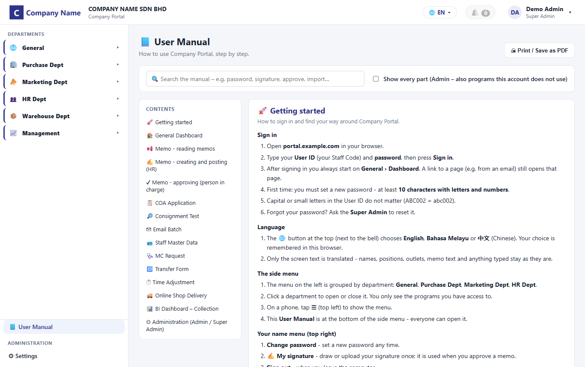
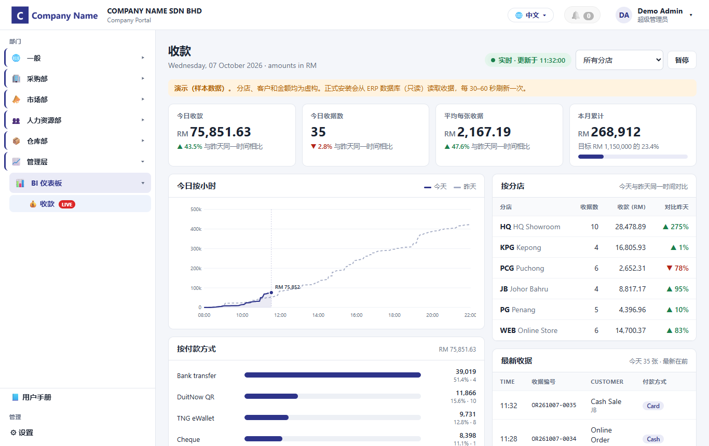
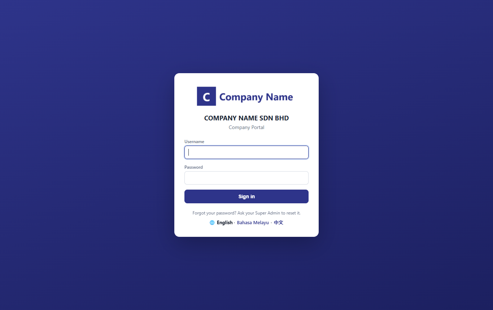
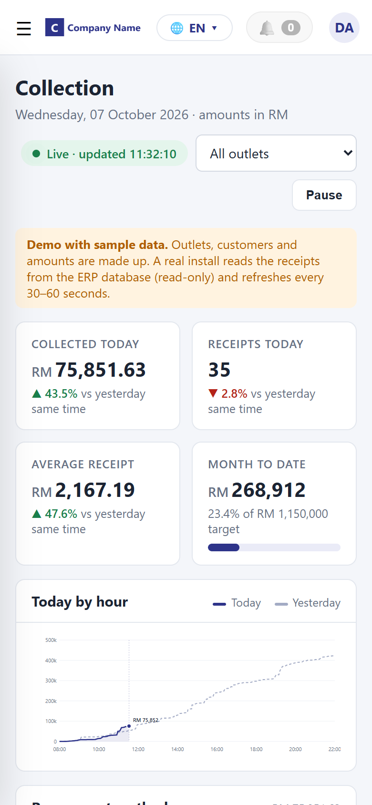
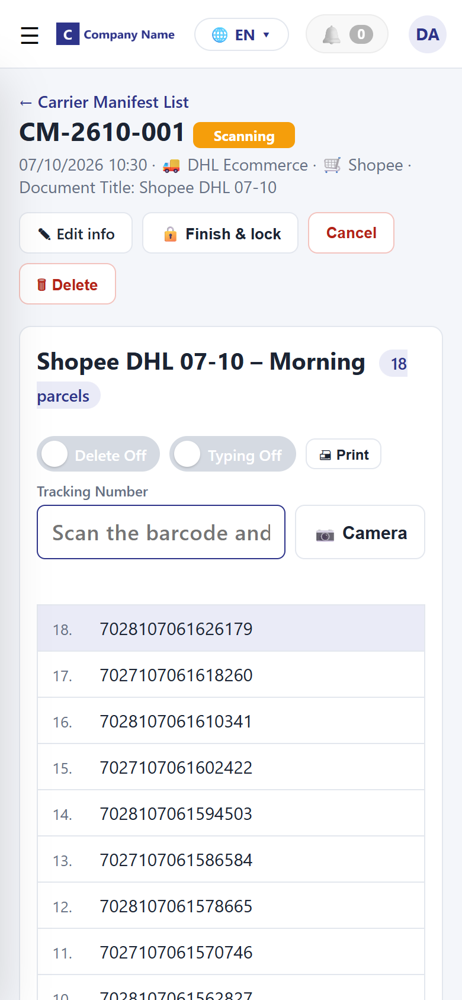

# Company Portal

An all-in-one internal web portal for a trading / retail company: product certification (COA), consignment testing, HR forms, memos with e-signature approval, warehouse parcel scanning, bulk email and a live BI dashboard – in English, Bahasa Melayu and 中文, usable on PC and phone.

It runs as **one Python file with no third-party packages** and a SQLite database, so it installs on any office PC in a minute: no build step, no npm, no Docker.

> This repository is a demo build. Company name and logos are placeholders, and the BI dashboard runs on generated sample data.

## Screenshots

**BI Dashboard – Collection** (updates live: KPIs vs yesterday, hourly chart, payment methods, outlets, latest receipts)



**Warehouse – carrier manifest scanning** (scanner or phone camera, duplicate and wrong-courier checks)



| Carrier manifest list | Built-in User Manual |
|---|---|
|  |  |
| **3 languages – 中文** | **Sign-in** |
|  |  |

**On the phone** (installable as an app)

<p>
  
  &nbsp;&nbsp;
  
</p>

## Modules

| Department | Program | What it does |
|---|---|---|
| General | Dashboard | What is new for each person: actions waiting, new memos, system updates |
| General | Memo | HR creates a memo (typed in 3 languages or an uploaded PDF), the person in charge approves it with their e-signature, then it is posted to the chosen staff |
| Purchase | COA Application | Multi-section certification form (A – I) with per-section rights, checklist, documents, versions and audit trail, COA expiry alerts by email |
| Purchase | Consignment Test | Inspection application with serial numbers, locations master list and documents |
| Marketing | Email Batch | One template with [Fields] + a customer list (Excel / CSV) → one personal email each, with a copy of every email kept |
| HR | Staff Master Data | Staff list with outlets, positions, departments and reporting structure; Excel import / export |
| HR | Transfer, Time Adjustment, MC Request | Outlet → HR workflows with statuses, evidence uploads, acknowledgement and printouts |
| Warehouse | Online Shop Delivery | Carrier manifest: scan tracking numbers (USB / Bluetooth scanner or the phone camera), duplicate and wrong-courier checks, lock, print the hand-over list |
| Management | BI Dashboard – Collection | Today's collection updating live: KPIs vs yesterday, hourly chart, by payment method and outlet, latest receipts |

Across the portal:

- **Access Control** – rights per person or per position, per section and program; Admin / Super Admin / User / Viewer accounts
- **Audit trail and document versions** – every change is kept with who, when, old and new value
- **3 languages** – English, Bahasa Melayu, 中文, switchable at any time
- **Installable app** – add to the phone's home screen (PWA, needs HTTPS)
- **Google Sheet / AppSheet sync** (optional) – read-only copy of the data and documents, plus memo approval from AppSheet
- **User Manual** built in, filtered to what each person may use

## Quick start

Requirements: Python 3.9 or newer.

```bash
python server.py
```

On Windows you can also double-click `start_server.bat`.

1. The first start picks a free port, saves it in `config.txt` and prints the address, e.g. `http://localhost:37214`.
2. Open the address. The first time, you create the **Super Admin** account.
3. Add users under **Settings › Users**, give rights under **Settings › Access Control**.

To choose the port yourself, put `PORT=8080` in `config.txt` (or set the `COA_PORT` environment variable). `BIND=127.0.0.1` keeps it to this PC only, e.g. behind a Cloudflare Tunnel or reverse proxy for HTTPS.

Full install, update and HTTPS notes: [README.txt](README.txt).

## BI dashboard and ERP data

The demo generates sample receipts in the browser so the dashboard can be tried without an ERP. In a real install the server would read the ERP database (Microsoft SQL Server, MySQL, …) through a **read-only** login: today's receipts every 30–60 seconds, past days copied on a schedule, one query shared by everyone watching. That needs one database driver (`pyodbc` or `pymysql`).

## Project layout

```
server.py            web server, API, database, email, Google Sheet sync – Python standard library only
sections.json        the COA form: sections, fields, checklist
manual*.json         User Manual (English / Bahasa Melayu / 中文)
updates.json         "What's new" list shown on the dashboard
public/              the web app: index.html, app.js, styles.css, translations, icons, service worker
data/                created on first start: SQLite database and uploaded files (not in git)
config.txt           created on first start: port and settings (not in git)
```

## Tech

Python 3 standard library (`http.server`, `sqlite3`, `smtplib`) · SQLite · plain JavaScript, HTML and CSS with no framework · PWA (manifest + service worker).

Passwords are stored as salted PBKDF2 hashes; sessions use HttpOnly cookies; failed sign-ins are throttled; every API call checks the person's rights on the server.

## Licence

GPL-3.0 – see [LICENSE](LICENSE).
